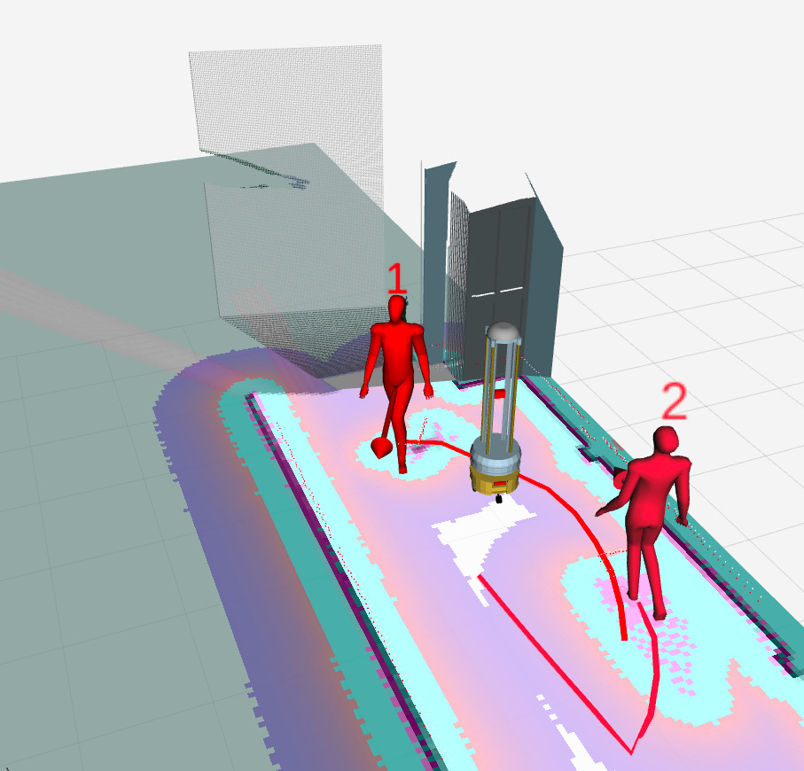
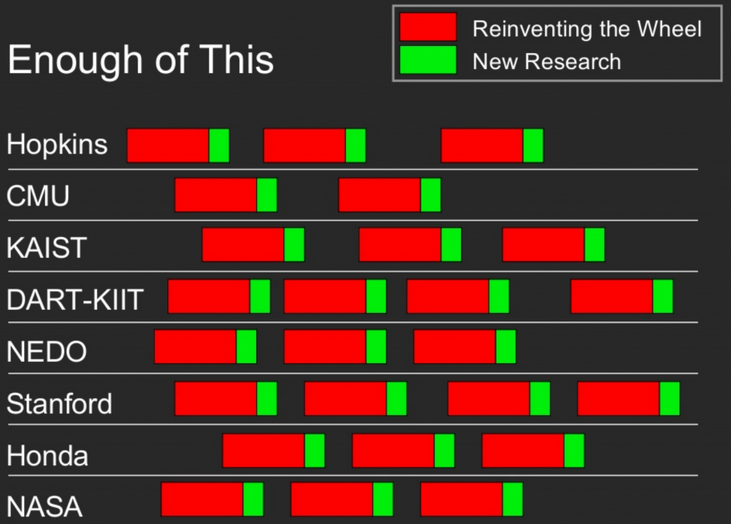
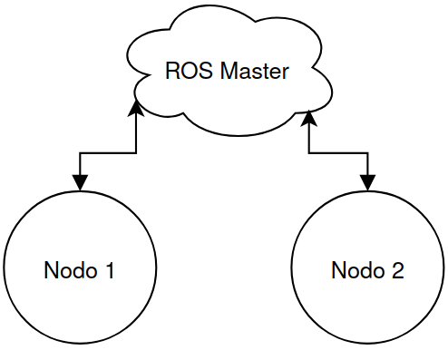
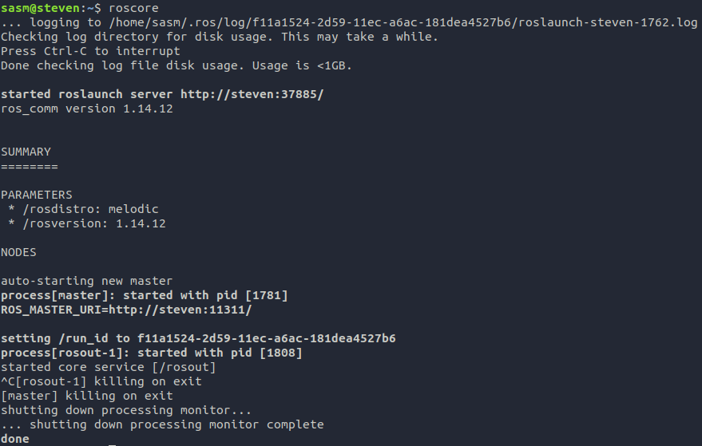
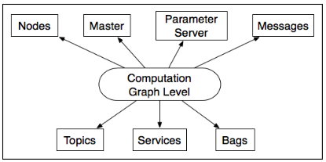
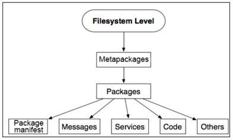

# Fundamentos de ROS

Por: Steven Silva

Auspician:


---

# Qué es ROS (Robot Operating System)?

- Hoy es el framework más estándar en robótica.
- Es una herramienta con un conjunto de subherramientas de terminal que nos permite tener un gran control sobre algoritmos de robótica o la ejecución de programas.
- De una manera más profunda, al ejecutar ROS se genera una red de comunicación estrella entre nodos y topics.

---

# Cómo nació ROS?

- Lo crearon Keenan Wyrobek y Eric Berger para dejar de `reinventar la rueda`.



Fuente: https://www.theconstructsim.com/history-ros/

---

- En esos tiempos los problemas eran:
  - Mucho tiempo dedicado a implementar una infraestructura de software para el robot.
  - Muy poco tiempo dedicado a realmente dar funcionalidades al robot.

Así es como obtuvieron la idea de realizar un framework que permita una comunicación fácil entre distintos procesos.

---


---

Otras opciones que se encontraban anteriormente, eran:

- Stage/Player
- URBI
- YARP

En el 2008 los creadores de ROS conocieron a Scott Hassan quien financió el desarrollo de ROS con su centro de investigación **Willow Garage**.
En el 2009 salio la primera distribución de ROS Mango Tango.

---

Por ese tiempo se decidió que la simulación 3D es importante y se integró **Gazebo** a ROS.


---

# Y cómo se usa esta cosa?





---

Los nodos pueden ser simples publicadores o subscriptores de mensajes que paralelamente realizan un proceso.





---

Para el intercambio de mensajes ROS necesita registrar el tipo de mensaje y su forma en un archivo de tipo `.msg` con un formato definido.

Por ejemplo, el mensaje de String básico de ROS del archivo `std_msgs/String`

```bash
string data
```

Un mensaje más complejo es el de `std_msgs/ColorRGBA`:

```bash
float32 r
float32 g
float32 b
float32 a
```

Para ver el formato de un mensaje de usa: `rosmsg info <directorio_mensaje>`.

---

# A crear un nodo!

Para iniciar con la creación de un nodo **subscriptor** y **publicador** seguiremos la guía de [Cómo generar tu primer nodo](GUIA_NODO_INICIAL.md).
